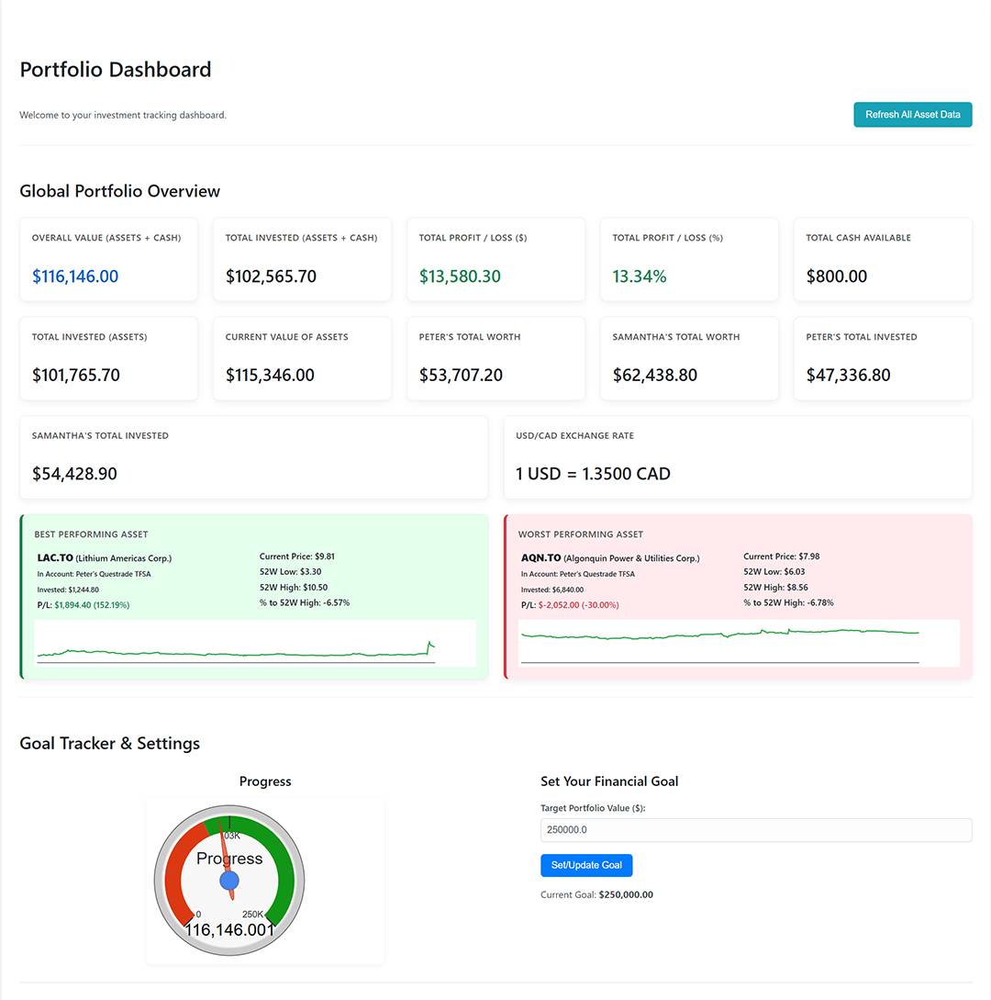

# Personal Investment Tracker 📈

A simple, locally-run web application built with Python and Flask to track Canadian investments across various platforms. It's designed for personal use and is great for tracking investments for multiple people (e.g., you and your spouse) across different accounts and platforms. Built using AI.
## Features

* **Manual Data Entry**: Easily add and manage users, platforms, accounts, and individual assets.
* **Detailed Asset Tracking**: For each asset, track quantity, average cost, total invested amount, and more.
* **Automatic Market Data**: Fetches and updates asset prices, previous close, and 52-week high/low from Yahoo Finance.
* **Interactive Dashboard**:
    * Global portfolio overview with total value, profit/loss, and cash.
    * Detailed breakdown by user, platform, and account.
    * Visual charts, including portfolio history, asset performance, and allocation by account.
    * A goal tracker gauge to visualize progress towards a financial target.
* **Simulators & Calculators**:
    * **Sell Profit Calculator**: See the potential profit/loss for selling an asset at a hypothetical price.
    * **Buy Calculator**: See the impact of buying more of an existing asset.
* **Full CRUD Functionality**: Create, Read, Update (Edit), and Delete all your data.

## Screenshot
* Partial Screenshot
(Click the image to view the full-page screenshot)

[](screenshot-full.png)

## Prerequisites

* Python 3.8 or newer
* Install Python by visiting https://www.python.org/. Download the latest version for your operating system.
* Git
* Install Git by visiting https://git-scm.com/downloads. Download the latest version for your operating system.

## Installation

1.  **Create a Project Folder:**
    First, create a folder on your computer where you'd like to store the application. Open your terminal or command prompt and run these commands:
    ```bash
    # Create a new folder (e.g., "MyApps")
    mkdir MyApps
    
    # Move into the new folder
    cd MyApps
    ```

2.  **Clone the repository:**
    Now, inside your new folder, run the following command to download the application code:
    ```bash
    git clone https://github.com/EverydayRelics/Personal-Investment-Tracker
    ```

3.  **Navigate to the project directory:**
    The previous command will have created a folder named `Personal-Investment-Tracker`. Move into it:
    ```bash
    cd Personal-Investment-Tracker
    ```

4.  **Create and activate a virtual environment:**

    * **Windows:**
        ```bash
        python -m venv venv
        .\venv\Scripts\activate
        ```
    * **macOS/Linux:**
        ```bash
        python3 -m venv venv
        source venv/bin/activate
        ```

5.  **Install the required libraries:**
    ```bash
    pip install -r requirements.txt
    ```

6.  **Initialize the database:**
    This will create a database `investment_tracker.db` file in the `database` folder.
    ```bash
    python init_db.py
    ```

7.  **Run the application:**
    ```bash
    python app.py
    ```
    The application will be running at `http://127.0.0.1:5000/`.

## How to Use

1.  Open your web browser and go to `http://127.0.0.1:5000/`.
2.  Start by navigating to **"Manage Users"** and **"Manage Platforms"** to add your details (e.g., your names, and platforms like Questrade, Wealthsimple..etc).
3.  Go to **"Manage Accounts"** to create your specific accounts (e.g., Peter's TFSA Questrade), linking them to a user and platform.
4.  Click **"Manage Assets"** for an account to start adding your individual stocks, ETFs, or crypto holdings. The app will fetch market data when you add a new asset.
    * **Important:** For the app to fetch market data correctly, you must use the ticker symbol exactly as it appears on Yahoo Finance. This often includes an exchange suffix for Canadian stocks. For example, for Algonquin Power & Utilities Corp., use `AQN.TO`.
    * **Note:** "Average Cost (per unit)" and "Total Invested Amount" are both manual entries. This allows for flexibility in how you track your cost basis.
5.  Use the **"Refresh Data"** buttons to get the latest market prices.
6.  Return to the **Dashboard** to see your complete portfolio overview!

## Create a .bat file (Optional Shortcut for Windows)

To make starting the application easier on Windows, you can create a simple batch file.

1.  Open a plain text editor (like Notepad).
2.  Copy and paste the code below into the text file.
3.  **Important:** Change the path on the second line (`cd /d C:\path\to\your\Personal-Investment-Tracker`) to the actual full path where you cloned the project folder.
4.  Save the file as `start_app.bat` inside your main project folder (`Personal-Investment-Tracker`).

Now, you can simply double-click `start_app.bat` to activate the environment and run the application.

```batch
@echo off
cd /d C:\path\to\your\Personal-Investment-Tracker
call venv\Scripts\activate.bat
python app.py
pause
```

## License

This project is licensed under the MIT License.